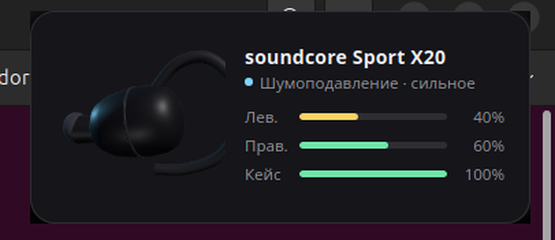

# soundcore-x20-linux

Управление наушниками **soundcore Sport X20** (и другими устройствами Soundcore)
из Linux: всплывающий 3D-виджет при подключении, панель настроек, индикатор
заряда в верхней панели и переключение шумоподавления по хоткею.

Фирменное приложение Soundcore существует только для телефона. Под Linux
остаётся [OpenSCQ30](https://github.com/Oppzippy/OpenSCQ30), который умеет
говорить с наушниками по проприетарному протоколу Anker. Этот проект — надстройка
над его CLI, добавляющая всё то, чего не хватает на рабочем столе.



## Что умеет

- **Всплывающий виджет при подключении** — 3D-модель наушника, заряд по каждому
  вкладышу и кейсу отдельно, текущий режим. Уезжает сам; наведение мыши удерживает.
- **Панель настроек** — режимы звука, сила шумоподавления, подавление ветра,
  22 пресета эквалайзера, переназначение всех жестов на кнопках, автовыключение,
  прошивка и серийный номер.
- **Индикатор в верхней панели** — процент заряда рядом с часами, меню быстрой
  смены режима. Появляется только когда наушники подключены.
- **Хоткеи** — `Super+Shift+N` переключает режим, `Super+Shift+H` открывает панель.


## Почему это не жрёт батарею

Опроса нет нигде — всё построено на событиях:

| Что | Откуда узнаём |
|---|---|
| Подключение наушников | сигналы BlueZ на системной шине DBus |
| Заряд | сигналы UPower |
| Режим шумоподавления | перечитывается в момент открытия меню |

Индикатор в простое расходует **0 мс CPU за минуту** (замерено счётчиком
`/proc/<pid>/stat`). Виджет вообще не висит в памяти: это одноразовый процесс,
который показался и вышел, а 3D-сцена останавливает `requestAnimationFrame`,
как только заканчивается вращение.


## Требования

- Linux с GNOME (проверено на Ubuntu 24.04, X11) и systemd
- `bluez`, `libnotify-bin`, `python3-gi`, `gir1.2-webkit2-4.1`
- `gir1.2-ayatanaappindicator3-0.1` — для индикатора в панели
- [`openscq30-cli`](https://github.com/Oppzippy/OpenSCQ30/releases) в `~/.local/bin/`

```bash
sudo apt install bluez libnotify-bin python3-gi gir1.2-webkit2-4.1 \
                 gir1.2-ayatanaappindicator3-0.1
```

## Установка

```bash
git clone https://github.com/raissov/soundcore-x20-linux.git
cd soundcore-x20-linux
./install.sh
```

`install.sh` не требует `sudo`: он найдёт сопряжённые наушники (при нескольких
устройствах Soundcore спросит, какое из них ваше), запишет конфиг, поставит
systemd-юниты в `~/.config/systemd/user`, ярлык в меню приложений и хоткеи GNOME.

Конфиг живёт в `~/.config/soundcore-x20/config`:

```ini
HEADSET_MAC=XX:XX:XX:XX:XX:XX
OPENSCQ30_CLI=~/.local/bin/openscq30-cli
```

## Устройство проекта

```
bin/headphone-notify.sh   демон на событиях DBus: ловит подключение
bin/anc-toggle.sh         переключение режима по кругу (хоткей)
bin/lib.sh                общая шапка: конфиг и пути DBus
widget.py                 всплывающий виджет (GTK3 + WebKit2)
settings.py               панель настроек
indicator.py              индикатор в верхней панели
hpcommon.py               общее: конфиг, вызовы openscq30-cli, рабочий поток
web/                      интерфейс: three.js-модель и страницы
```

Панель настроек строится **по схеме, которую отдаёт само устройство**
(`openscq30-cli list-settings --json`), а не по захардкоженному списку —
поэтому показывает всё, что умеет конкретная модель, и переживёт обновление
прошивки.

## Грабли, на которые я наступил

Собрано по ходу разработки — возможно, сэкономит кому-то вечер.

- **`upower` отдаёт 0% сразу после подключения.** Устройство уже видно, а заряд
  ещё не отрапортован. Retry-цикл, ждущий только *пустое* значение, выходит на
  первой попытке с мусорным нулём и показывает ложную тревогу о разряде. Ждать
  надо и ноль тоже.
- **`get` после `set` в openscq30-cli ничего не подтверждает** — по его же
  документации он печатает то значение, которое вы задали. Проверять успех
  нужно по коду возврата.
- **Состояние устройства обновляется с задержкой ~2 секунды.** Наивный
  read-modify-write ломается при частых нажатиях хоткея: цикл залипает.
  Решение — файл состояния с меткой времени.
- **ES-модули не работают с `file://`** — origin равен `null`, и WebKit рубит
  импорт соседнего файла по CORS. Лечится своим URI-скоупом, без HTTP-сервера.
- **WebKit рисует `<select>` нативно** и игнорирует CSS-цвета: получается белый
  прямоугольник со светлым текстом, то есть невидимый. Нужен `appearance: none`.
- **`set_default_size` игнорируется при `set_resizable(False)`** — GTK берёт
  натуральный размер дочернего виджета. Лечится `set_size_request`.
- **mutter не поднимает окно, запущенное не из клика по нему** (защита от
  перехвата фокуса) — панель открывалась за другими окнами.
- **В теме Yaru нет иконок `battery-full` и `battery-good`** без суффикса
  `-symbolic`, при этом `notify-send` возвращает успех и просто рисует пустоту.

## Чего здесь нет

- **Тонкая настройка полос эквалайзера.** Устройство отдаёт 10 значений при
  заявленных 8 полосах, и все равны максимуму — записывать туда вслепую опасно.
  Полосы показаны только для чтения, доступны 22 пресета. Для остального —
  родной GUI OpenSCQ30.
- **Авто-пауза при снятии наушника.** В протоколе нет датчика ношения.
- Импорт/экспорт своих профилей эквалайзера и удаление сопряжённых устройств —
  помечены в панели как «в OpenSCQ30».

## Благодарности

Вся низкоуровневая работа с протоколом Anker — заслуга
[OpenSCQ30](https://github.com/Oppzippy/OpenSCQ30) (Oppzippy). Без него ничего
из этого не существовало бы.

## Лицензия

MIT — см. [LICENSE](LICENSE).
